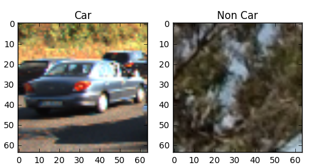

# CarND - Vehicle Detection - Project Report

***

_The code referenced in this markdown is from [this IPython notebook] (CarND - Vehicle Detection.ipynb)._


## Goal and Objective
---

The goals / steps of this project are the following:
- Perform a Histogram of Oriented Gradients (HOG) feature extraction on a labeled training set of images and train a classifier Linear SVM classifier.
- Optionally, you apply color transform and append binned color features, to HOG feature vector.
- Train a classifier to disinguish between car and non-car images
- Implement a sliding-window technique and use your trained classifier to search for vehicles in images.
- Run vehicle detection pipeline on a video stream and create a heat map of recurring detections frame by frame to reject outliers and follow detected vehicles.
- Estimate a bounding box for vehicles detected.

<sub>References - https://github.com/sumitbinnani/CarND-Vehicle-Detection </sub>


## 1.  Histogram of Oriented Gradients (HOG) feature extraction

The code for this step is defined in the `utils.py` file inside the `get_hog_features` method.  

The images are read as into two variables `cars` and `non_cars`. A random image selected from both the classes is shown below.



After this, I explored the `skimage.feature.hog()` function and tweaked its various parameters like `pixels_per_cell`, and `cells_per_block` to obtain an optimum result. Following is an example of the hog features of a member of the car class with `color_space = 'YCrCb'`, `orient = 9`, `pix_per_cell = 8` and `cell_per_block = 2`


## 2. Feature Extraction for Model

After several hit and trial iterations, these are the parameters that I used

```
color_space = 'YCrCb'
spatial_size = (32, 32)
hist_bins = 32
orient = 9
pix_per_cell = 8
cell_per_block = 2
hog_channel = 'ALL'
spatial_feat = True
hist_feat = True
hog_feat = True
```


## 3. Train-Test Split 

The `train_test_split` from `sklearn.model_selection` was used to randomized the data and make a 80-20% train-test split. The split was made so as to keep the ratio of cars and non-cars similar.


## 4. Model Training and Testing

The extracted features where fed to `LinearSVC` model of `sklearn` with default settings. The trained model had accuracy of `99.27%` on test dataset. 

The trained model along with the parameters used for training were written to a `pickle` file to be further used by vehicle detection pipeline.

---

## 5. Vehicle Detection Pipeline


### 5A. Sliding Window Search
I defined a function, `find_cars` inside the `utils.py`, that extracts the features using hog sub-sampling and makes predictions. A sample output from the same is shown below.


### 5B. Multi-Scale Search

The following scales for the multi-window search and overlap to be considered were decided emperically.

Scale 1: `ystart = 380, ystop = 480, scale = 1`

Scale 2: `ystart = 400, ystop = 600, scale = 1.5`

Scale 3: `ystart = 500, ystop = 700, scale = 2.5`


### 5C. Avoiding False Positives and Label Detection
#### 1. Feature Selection
Using `YCrCb` color space, the number of false positives were stemmed.

#### 2. Heatmaps and Label Detection
I recorded the positions of positive detections in each frame of the video.  From the positive detections I created a heatmap and then thresholded that map to identify vehicle positions.  I then used `scipy.ndimage.measurements.label()` to identify individual blobs in the heatmap.  I then assumed each blob corresponded to a vehicle.  I constructed bounding boxes to cover the area of each blob detected.  


### 5C. Search Optimization (Restricted Search)

The search was optimized by processing complete frames only once every 10 frames, and by having a restricted search in the remaining frames. The restricted search is performed by appending 50 pixel to the heatmap found in last three frames.

The complete step 5 is implemeted in the file `VehicleDetector.py`


## 6. Video Implementation
---

### 1. Vehicle Detection
The final implementation can be accessed [here](https://youtu.be/I1GU_e8Rpzw).

[](https://youtu.be/I1GU_e8Rpzw)


## Discussion
---
The multi-window search implemented here may be optimized further for better speed and accuracy.
 
Also, the developed pipeline will probably fail in varied lighting and illumination conditions. A neural network based model might provided better results for the classification for vehicles in such scenarios.
